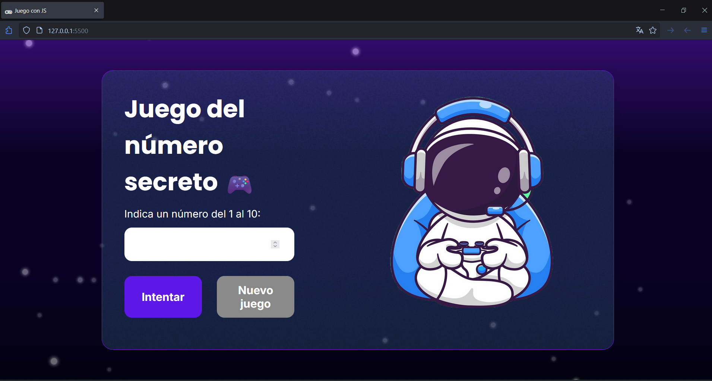

# 🎮 Juego del número secreto  

Este es un pequeño juego interactivo desarrollado con **HTML, CSS y JavaScript** donde el jugador debe adivinar un número secreto generado aleatoriamente.  

## 🚀 ¿Cómo jugar?  

1. Ingresa un número entre **1 y 10** en la caja de entrada.  
2. Haz clic en el botón **"Intentar"** para verificar si acertaste.  
3. Si el número es incorrecto, recibirás una pista:  
   - "El número secreto es mayor" si el número ingresado es menor.  
   - "El número secreto es menor" si el número ingresado es mayor.  
4. Continúa intentando hasta adivinar el número.  
5. Cuando aciertes, verás cuántos intentos realizaste y podrás iniciar un **nuevo juego**.  

## 🛠️ Tecnologías utilizadas  

- **HTML** → Estructura del juego.  
- **CSS** → Estilos y diseño.  
- **JavaScript** → Lógica del juego, generación de números aleatorios y manejo de eventos.  

## 📝 Características del código  

El juego utiliza varios conceptos de **JavaScript**, incluyendo:  

✔ **Funciones** → Para modularizar la lógica del juego.  
✔ **Listas (Arrays)** → Para registrar números generados y evitar repeticiones.  
✔ **Template Strings** → Para mejorar la legibilidad de los mensajes al usuario.  
✔ **Math.random() & Math.floor()** → Para generar el número secreto de forma aleatoria.  
✔ **Manipulación del DOM** → Para actualizar dinámicamente los mensajes y botones.  
✔ **Eventos en botones** → Para verificar intentos y reiniciar el juego.  

## 🎨 Vista previa  

  

## 🔧 Instalación y uso  

1. Clona el repositorio:  

   ```bash
   git clone https://github.com/marisol161/logicaDeProjramacionJS.git

2. Accede a la carpeta del proyecto:

   ```bash
   cd logicaDeProjramacionJS
   ```

3. Abre el archivo index en tu navegador

## ✨ Contacto  

Si tienes sugerencias, comentarios o quieres compartir tus mejoras, ¡será un gusto conectar contigo! Puedes encontrarme en:  

📌 **GitHub**: [marisol161](https://github.com/marisol161)  
📌 **LinkedIn**: [Marisol Rosaldo](https://www.linkedin.com/in/marisol-rosaldo-dvjr)  

